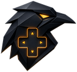

# Ravensight Godot SDK

Official Godot 4 SDK for [Ravensight](https://ravensight.io): player
analytics for indie games. One autoload script gives your game:

- **Batched event tracking** with an offline queue and automatic retry
- **Session management**: device IDs, publishable ingest keys, token refresh
- **Rate-limit aware**: honors 429 + Retry-After with backoff, never loses events
- **Server kill switch**: disable tracking remotely without shipping a patch
- **In-game player feedback**: bug reports and ratings straight from players
- **Suggestions API** (experimental): machine-readable tuning hints derived
  from Ravensight's weekly AI analysis

## Install

1. Copy `Ravensight.gd` into your project (e.g. `res://addons/ravensight/`).
2. Project → Project Settings → Autoload → add it, named `Ravensight`.
3. In the Inspector set `api_url` (`https://api.ravensight.io`) and your
   game's `ingest_key` (`gt_live_...`, from the Ravensight dashboard,
   publishable, safe to ship in your binary).

## Use

```gdscript
Ravensight.track_event("level_start", {"level": "level_3"})
Ravensight.track_event("player_died", {"level": "level_3", "cause": "spikes"})
Ravensight.submit_feedback("The boss feels unfair", "complaint", 2)
```

Full guide: https://github.com/Reality-Software-Entertainment/ravensight,
see `GODOT_GUIDE.md`.

## License

MIT
